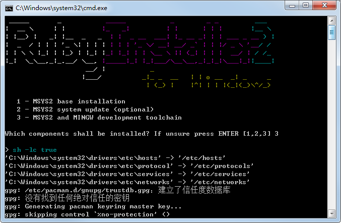

# Linux本地安装 Jekyll

## 下载Ruby及依赖
```bash
apt install ruby-full ruby-dev gcc libffi-dev make g++ zlib1g-dev
```bash

## 安装Bundler
```bash
sudo gem install bundler
sudo gem install pygments.rb
```

## 克隆Github到本地
```bash
git clone git@github.com:NiYa193/qcow.github.io.git && cd qcow.github.io.git
```

## 更新安装bundle
```bash
## 更新时会遇到很多库依赖的问题，直接安装对应库就可以了
bundle update --bundler   ## 可能要输入root密码
bundle install
```

## 开启服务
```bash
jekyll serve -H 192.168.1.1 -P 8080  # 虚拟机的话一定是虚拟机的IP
## 如果失败，可以尝试
bundle exec jekyll serve -H 192.168.1.1 -P 8080
```


# windows本地安装 Jekyll

## 下载Ruby
推荐下载 Ruby + Devkit 版本：[链接](https://rubyinstaller.org/downloads/) 

## 安装 Ruby
安装完成后，点击Finish，会跳到cmd命令窗口，选3:


检查是否安装完成：
```bash
ruby -v
gem -v
```

## 安装 Jekyll
```bash
gem install jekyll
```

检查是否安装完成：
```bash
jekyll -v
```

## 启动server
```bash
jekyll serve 
```

# 定制化
## 主题选择
主题可以网站选择： [链接](http://jekyllthemes.org)


